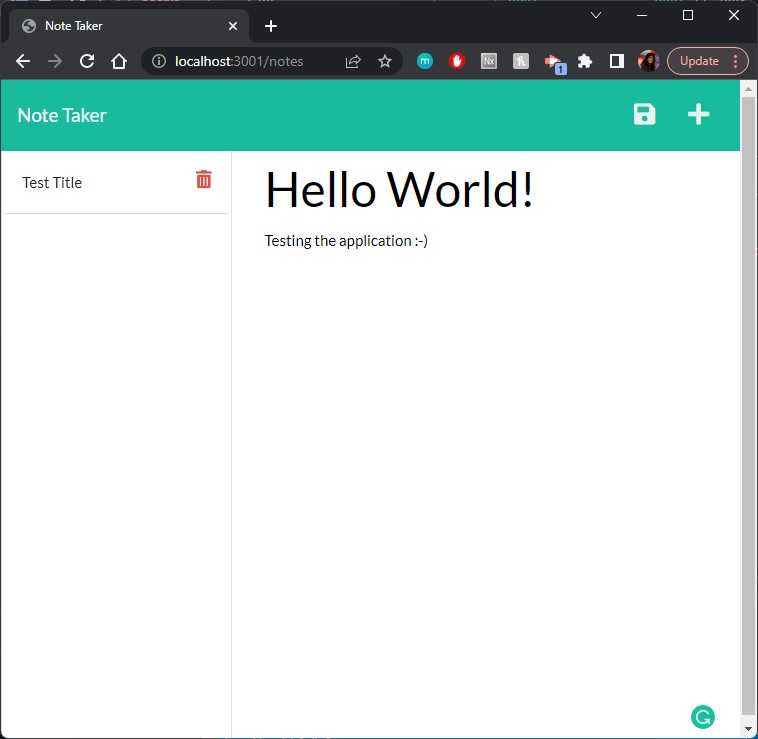

# Note Taker

## Description

This application is used to write and save notes by writing and retrieving data from a JSON file. [Express.js](https://expressjs.com/) is utilized to develop the back-end code.

## Deployed Link

This application is deployed through [Heroku](https://www.heroku.com/what).
> https://akc-note-taker.herokuapp.com/


## Table of Contents

- [User Story](#user-story)
- [Installation and Usage](#installation-and-usage)
- [Technologies Utilized](#technologies-utilized)
- [Screenshots and Walkthrough](#screenshots-and-walkthrough)
- [Contributors](#contributors)
- [License](#license)


## User Story

```md
AS A small business owner  
I WANT to be able to write and save notes  
SO THAT I can organize my thoughts and keep track of tasks I need to complete
```


## Installation and Usage

In order to run this application, you will want to `git clone` this repository so that the code is on your local machine. Run `npm i` while in the root directory in order to install all necessary [Node.js](https://nodejs.org/en/) dependencies. Then run `npm start` to launch the server.

This application is hosted at Port 3001, so typing: `http://localhost:3001/` into the address bar of your browser (while the server is running) should display the user interface.

Alternatively, you can simply visit my [Deployed Link](https://akc-note-taker.herokuapp.com/).

Once in the application, hit the "Get Started" button to open up the Note Taker. The left-hand column contains existing notes while the right-hand column contains an empty field for a new note. Once a new note is entered, a save icon appears. Clicking the save icon places the newly created note in the left-hand column alongside the other existing notes.  
  
Users may view previous notes in the left-side column by clicking on them. Users may also navigate back to create a new note by clicking on the "Write" icon at the top of the page.


## Technologies Utilized

> [Javascript](https://www.javascript.com/)

> [Express.js](https://expressjs.com/)

> [Node.js](https://nodejs.org/en/)
> - [Express.js npm](https://www.npmjs.com/package/express)
> - [uuid npm](https://www.npmjs.com/package/uuid)

> [Heroku](https://www.heroku.com/what)


## Screenshots and Walkthrough


*Creating a new note*
</br>
Hitting the "Save" icon in the top right will save your newly made note into your list on the left-hand side.


## Contributors

Thank you for checking out my project! If you would like to see more of my work, please take a peek at my [GitHub](https://github.com/anitachengalva/) and [portfolio](http://anitachengalva.github.io/portfolio).

[ LinkedIn](https://www.linkedin.com/anitachengalva)
&nbsp;
[ GitHub](https://github.com/anitachengalva)


## License

This project is licensed under the MIT License &nbsp; &nbsp; &nbsp; [](https://choosealicense.com/licenses/mit/)

Please click on the green MIT License Shield above to learn more about what the limitations of this license are.